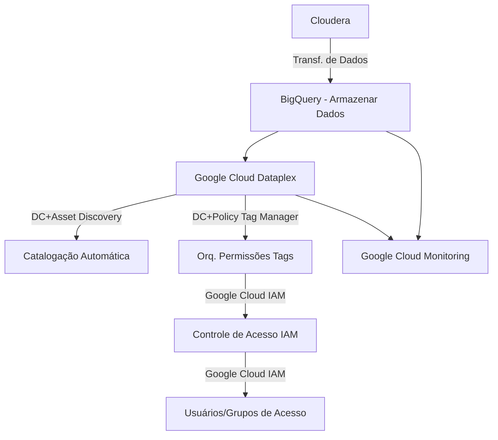

# Relatório de Sprint

Esse relatório tem como base demonstrar as tarefas e resultados que foram obtidos na sprint.

## Kelvin Silvestre da Costa

### O que está fazendo?

Criação de um conjunto de APIs que tem como objetivo fazer a validação dos conhecimentos obtidos na trilha de fullstack backend. Devem ser feitas três APIs para o recebimento, validação e salvamento de dados em Bancos de Dados. Além das APIs serão usados Postgres, MongoDB e RabbitMQ.

### Resultados

Atualmente das três APIs necessária para o fim do projeto duas ja estão funcionando e fazendo seus serviços, apenas faltando pequenos ajustes para melhores práticas. Para a terceira API falta fazer a lógica e a implementação do MongoDB.

### Dúvidas

Organização de volumes no Docker. Dúvidas sobre quantas e como funcionarão as queues do RabbitMQ. Dúvidas sobre o tratamento de erros.

## João Gabriel Barbosa

### Oque foi feito

No momento o foco foi na prática dos tópicos levantados na ultima reunião, foram realizados estudos sobre a **Governaça de Dados**, e sobre Ideias de **Propostas** que podem agregar a implementação do Dataplex, e sobre como poderiamos fazer automatizações após testes realizados para o entendimento da plataforma, um dos focos foi a ideia de implementação de segurança nos serviços do dataplex como criptografia no trafégp dos dados e ideias de backups dos dados

### Resultados (propostas, oque foi entendido)

Os serão obtidos apos a realização dos testes pois a squad está em processo de entendimento da ferramenta pois não há muito conteudo sobre **Dataplex** em geral, então usamos a documentação do **GCP** para estudos e em partes tivemos alguns avanços. Em geral foi focado mais em teória do que em prática para um melhor entendimento sobre os assuntos pois ainda existem muitas dificuldades em realação ha ferramenta.
O propósito é realizar testes para agregar nos resultados da squad.

### Dúvidas

1 - Como encontrar mais conteúdo sobre a ferrementa para estudos mais aprofundados com exemplos práticos como o **BIG QUERY** possui.

## Julia Torres

### O que foi feito?

Foi seguindo um plano de estudos sobre o Dataplex, uma ferramenta que ainda não foi muito explorada. O Dataplex é uma plataforma do Google Cloud voltada para a governança e gerenciamento de dados distribuídos, permitindo a organização, controle e monitoramento de dados em grande escala, especialmente em ambientes multi-cloud.

Foi estudando governança de dados, que envolve o registro e gerenciamento do ciclo de vida de todos os ativos de dados dentro de uma empresa. O Dataplex facilita a criação de políticas e automação para garantir que os dados estejam com as normas e regulamentos. Ele organiza os dados em zonas de dados, que são utilizadas para classificar os dados com base na sua finalidade, origem ou outros critérios.

Foi conversado com os colegas de equipe sobre a segurança no Dataplex, que envolve o controle de acesso por meio do IAM e criptografia de dados em trânsito. Isso garante que os dados sejam acessados de forma segura e por pessoas autorizadas. Até então os conhecimentos adquiridos não foram colocados em prática.

### *Principais Desafios Enfrentados*
Um dos principais desafios até agora foi entender como configurar corretamente as zonas de dados e aplicar as políticas de acesso de forma eficiente. Além disso, ainda não forma encontrados muitos exemplos práticos e teóricos que ajudem a ter uma visão clara de como implementar o Dataplex no dia a dia.

### *Dúvidas:*

* Integração com outras ferramentas do Google Cloud como BigQuery e Dataflow.  
* Configuração das zonas de dados e a aplicação das políticas de segurança.  
* Monitoramento contínuo da qualidade dos dados e como isso impacta a governança.

### *Próximos passos:*

* Colocar em prática a criação de zonas de dados e explorar como organizar dados de diferentes fontes.  
* Testar o monitoramento de qualidade dos dados no Dataplex.  
* Buscar mais exemplos práticos ou tutoriais, além de consultar a documentação oficial e discutir mais profundamente com colegas.  
* Dessa forma, o ambiente GCP será configurado com as tabelas e views necessárias para a análise completa dos dados, garantindo tanto a segurança quanto a governança adequada dos ativos.

## Lucas Lima Leite

Estudou e desenvolveu um modelo de governança de dados num ambiente mockado utilizando a ferramenta Dataplex e Data Catalog, com o intuito de aplicar essa experiência no projeto FinOps com ajustes necessários e em maior escala.  

Diante das necessidades, foi realizado um estudo raso sobre **Governança de dados** crua, e um estudo mais aprofundado sobre o **Dataplex e Data Catalog**, e como aplicar governança de dados utilizando essas ferramentas. 

*report abaixo* ⬇️

- [Relatório de Estudos](https://github.com/2RP-Squad404/Lucas_Leite/blob/feature/data_governace/Relatorios/Dataplex%2C%20Governa%C3%A7a%20de%20dados/gorverna%C3%A7a_dataplex_datacatalog.md).  

Além disso, com relação a squad, foram realizadas dailys, de forma a compartilhar o conhecimento adquirido durante os dias, e auxiliar aqueles que tiveram impedimentos. Dado essas necessidades, prestou suporte as necessidades do grupo disponibilizando um roteiro de estudos para gerar um norteamento, e junto da squad realizou a implementação parcial da governança dos dados no ambiente mockado.

### Resultados

* **Catalogação:**
    * Unificação os dados de um *departamento específico* no **Data Lake**, utilizando o **Dataplex**.

    * Criadas *Zonas* para separar esses dados em seus respectivos formatos (RAW, CURATED DATA, DATA AS A PRODUCT/produto de análise).

    * A partir de cada *Zona*, foi anexado os dados respectivos (**Assets**). Como por exemplo na **RAW-DATA-ZONE**, foi anexado os **arquivos .csv**.

    * Com o *Lake*, *Zonas* e *Assets* criados, foram gerados também as **Tag Templates** as quais vão definir a catalogação dos dados das tabelas, colunas, datasets, etc.

    * Após isso essas Tags foram **anexadas** as tabelas, colunas e datasets, catalogando os dados existentes.

    * Para melhor vizualização dos dados, o **Dataplex** disponibiliza a uma aba de *Pesquisa*, onde foi possível encontrar os dados relaciondos a cada **Tag**, **Tabela**, **Coluna**, etc.

* **Permissionamento:**
    * Gerar parcialmente permissionamento para individuos ou grupos, de forma que sua permissão seja associada a tabela, dataset, colunas, etc.

### Dificuldades:

* Dificuldade para encontrar material técnico sólido sobre as ferramentas.

* Pouco tempo para aprofundar o conhecimento sobre todas as funções das ferramentas propostas.

* Problemas com o uso de parte das ferramentas por conta da necessidade de uma conta **organizacional**.

* Duvidas com relação a como implementar tudo o que vimos sobre as ferramentas no ambiente do projeto FinOps.

## Gabriel Roberto Alvim  
### Governança de Dados
A governança de dados refere-se ao conjunto de práticas, políticas e processos que garantem a gestão adequada dos dados dentro de uma organização. O objetivo é assegurar que os dados sejam precisos, acessíveis, seguros e usados de maneira eficiente e ética. Sendo crucial para assegurar que os dados sejam geridos de forma eficaz e que contribuam para os objetivos estratégicos da organização, ao mesmo tempo que mitigam riscos e garantem conformidade com as normas e regulamentações aplicáveis

### DAMA - Pilares de Governança de Dados

- *Qualidade dos Dados*: Estabelecer padrões e processos para garantir que os dados sejam precisos, completos e confiáveis.

- *Segurança dos Dados*: Implementar medidas para proteger os dados contra acesso não autorizado, perda ou vazamentos. Isso inclui controles de acesso, criptografia e políticas de privacidade.

- *Compliance e Regulamentação*: Garantir que a gestão de dados esteja em conformidade com leis e regulamentos, como o GDPR na União Europeia ou a LGPD no Brasil.

- *Estrutura e Responsabilidade*: Definir papéis e responsabilidades claros para a gestão dos dados dentro da organização. Isso pode incluir a nomeação de um Chief Data Officer (CDO) ou a formação de comitês de governança.

- *Armazenamento e Arquivamento*: Gerenciar onde e como os dados são armazenados, garantindo que sejam mantidos de maneira adequada e eficiente.

- *Acesso e Uso*: Estabelecer políticas sobre quem pode acessar os dados e como eles devem ser utilizados, para garantir que o acesso seja apropriado e os dados sejam usados de forma ética.

- *Documentação e Metadados*: Manter uma documentação clara e detalhada sobre os dados, incluindo o que são, de onde vêm, e como devem ser usados. Isso inclui o gerenciamento de metadados, que são dados sobre os próprios dados.

### Dataplex
Dataplex é uma solução de governança e gerenciamento de dados que ajuda as organizações a gerenciar, governar e analisar dados em diversos ambientes de armazenamento. Ele fornece uma plataforma centralizada para definir e aplicar políticas de dados, inclui ferramentas para descobrir e catalogar dados, e melhora a qualidade e integridade dos dados. O Dataplex também facilita a análise de dados, assegura a segurança e conformidade, e ajuda no gerenciamento de data lakes. O objetivo é simplificar a gestão de dados em grande escala e permitir que as organizações se concentrem em obter insights valiosos.

### Recursos Utilizados:
- [GCP Doc.](https://cloud.google.com/dataplex?hl=pt-BR)
- [Stackoverflow](https://stackoverflow.com/questions/78426963/confusion-about-metadata-in-google-dataplex-and-data-catalog)
- [Aula](https://www.youtube.com/watch?v=5-NtozDQVBQ&t=1096s)
#

### Fluxograma de migração (sem processamento de dados)

### Descrição do Fluxograma de Migração de Dados com BigQuery e Dataplex

### 1. Cloudera
    O processo começa com os dados armazenados na plataforma Cloudera. Esses dados serão transferidos para a nuvem, onde serão organizados e governados.

### 2. Transferência de Dados para o BigQuery
    Os dados são transferidos diretamente do Cloudera para o BigQuery (GCP). No BigQuery, os dados são armazenados de forma otimizada para consultas e análises futuras, garantindo alta performance para grandes volumes de dados.

### 3. Google Cloud Dataplex
    Uma vez que os dados estejam armazenados no BigQuery, o Google Cloud Dataplex assume a responsabilidade de gerenciar a catalogação e a governança desses dados. Ele cria uma camada de organização e governança para centralizar o controle sobre o acesso e uso dos dados, facilitando a gestão em grande escala.

### 4. Catalogação Automática no Dataplex
    O Dataplex realiza a catalogação automática dos dados no BigQuery, gerando metadados que permitem a rápida localização e o uso dos dados. Isso facilita o acesso e a gestão eficiente, permitindo que diferentes serviços e usuários consigam consultar os dados facilmente.

### 5. Orquestração de Permissões com Tags
    Utilizando tags de taxonomia(classificação), o Dataplex organiza os dados em diferentes categorias, como "público", "restrito" ou "confidencial". Essas tags são utilizadas para aplicar políticas de controle de acesso de forma automatizada, assegurando que apenas os usuários autorizados tenham acesso aos dados relevantes.

### 6. Controle de Acesso Baseado em IAM
    O IAM (Identity and Access Management) gerencia as permissões de acesso com base nas políticas definidas pelo Dataplex. A atribuição de permissões é automática e baseada nas tags de taxonomia associadas aos dados, garantindo que cada usuário ou grupo tenha o nível de acesso apropriado.

### 7. Usuários e Grupos de Acesso
    Os usuários e grupos recebem permissões de acordo com suas necessidades e responsabilidades, definidas pelas políticas de IAM e aplicadas automaticamente pelo Dataplex. Isso assegura uma gestão eficiente e segura do acesso aos dados no BigQuery.

### 8. Monitoramento com Google Cloud Monitoring
    Todo o processo, desde a transferência de dados até o acesso e uso, é monitorado por meio do Google Cloud Monitoring. Isso permite o acompanhamento em tempo real, identificando possíveis problemas e garantindo que o desempenho das operações de migração e consulta esteja otimizado.
---

### Resumo das Ferramentas

| Funcionalidade                      | Ferramenta no Dataplex                                      |
| ----------------------------------- | ----------------------------------------------------------- |
| Catalogação Automática              | *Data Catalog* + *Asset Discovery*         |
| Orquestração de Permissões com Tags | *Data Catalog* (Tag Templates) + *Policy Tag Manager*   |
| Controle de Acesso IAM              | *Google Cloud IAM*                                        |
| Usuários e Grupos de Acesso         | *Google Cloud IAM*                                        |

### Resultados (Estudo e Aplicação)
- *Google Cloud Dataplex*: Ferramenta de governança e gerenciamento centralizado de dados. Apliquei catalogação de dados, definição de tags de políticas e controle de acesso de maneira eficiente, centralizando a gestão dos data lakes.

- *Data Catalog*: Ferramenta para catalogar e organizar dados. Estudei a automatização e catalogação de ativos no BigQuery, melhorando a identificação e gerenciamento por meio de metadados.

- *Policy Tag Manager*: Sistema de controle de acesso baseado em tags. Aprendi a usar tags de taxonomia para definir permissões e aplicar políticas de controle, categorizando dados entre confidenciais ou públicos.

- *Google Cloud IAM (Identity and Access Management)*: Gerenciamento de identidades e permissões. Apliquei permissões com base nas políticas do Dataplex, assegurando o acesso adequado aos dados.

- *Google Cloud Monitoring*: Ferramenta de monitoramento de performance. Executei testes para configurar monitoramento em tempo real para acompanhar processos de migração, consulta e uso de dados.

- *Data Loss Prevention (DLP)*: Ferramenta para proteger dados sensíveis. Aprofundei em aplicar DLP para identificar e proteger dados críticos, garantindo conformidade e segurança durante a transferência e armazenamento.

### Dúvidas & Dificuldades:
Dúvidas em relação a utilização das ferramentas e aplicações direcionadas ao projeto FinOps. 

Dificuldade ao acessar materiais pouco didáticos e técnicos. Principalmente atualizados.

## Gabriel Perosa

### Assuntos Abordados

### 1. Governança de Dados
O Dataplex facilita o gerenciamento de dados descentralizados, centralizando diversas ferramentas e funções para garantir uma governança eficiente. Ele permite a aplicação de políticas de segurança e qualidade, além de oferecer um controle centralizado em ambientes distribuídos.

### 2. Criação de Tags para Catalogação
As tags no Dataplex permitem a catalogação e classificação dos dados, definindo diferentes níveis de confidencialidade. Uma vez que os dados estejam organizados e classificados, o permissionamento pode ser feito de maneira mais precisa. As tags são essenciais para controlar quem pode acessar determinados dados ou realizar ações específicas, sendo usadas para aplicar regras de segurança e conformidade.

*Exemplo*: No Dataplex, você pode usar tags para aplicar políticas de acesso específicas a certos tipos de dados, permitindo maior controle sobre quem pode visualizar ou editar partes específicas. No BigQuery, as permissões são mais amplas: quando um papel de Editor é concedido, a pessoa pode editar todos os dados do dataset ou projeto, sem granularidade de controle.

### 3. Segurança em Zonas de Dados
O Dataplex permite a implementação de zonas de segurança para separar dados sensíveis de dados públicos ou menos críticos. Isso garante que os dados mais importantes tenham um nível adicional de proteção, com diferentes camadas de segurança aplicadas conforme a criticidade dos dados.

### Prática
Com os datasets fornecidos, foram realizados testes de catalogação com as tags e a tentativa de permissionamento. No entanto, não foi possível aplicar o permissionamento por tags, uma vez que esta funcionalidade só está disponível em organizações que implementaram o Dataplex de forma completa.

### Laboratórios Realizados:
- Dataplex: Qwik Start – Console
- Tagging Dataplex Assets
- Implementing Security in Dataplex
- Assessing Data Quality with Dataplex

### Dificuldades
Durante a execução dos laboratórios e testes, uma das principais dificuldades foi a falta de conteúdo disponível, especialmente em inglês, dificultando o aprofundamento em certas áreas da plataforma.

## Propostas Gerais:

* Permissionamento de grupos (squads), via Tags, Zonas ou Lakes. 
    * Porém no nosso caso não é possível realizar o permissionamento via Tags utilizando uma conta **Pessoal**, é necesário utilizar uma conta **Organizacional**.

* Regras de negócio para garantir que as atividades realizadas estejam de acordo com a conformidade das regras da empresa ou segurança, utilizando configuração de auditoria e conformidade.

* Ferramenta **DLP** (Data Loss Prevention), que realiza a proteção de dados sensíveis ou pessoais, criptografando-os, e pode ser integrada ao **Dataplex**. 

* Utilização do Terraform para gerenciar o ambiente GCP. ("sabemos que é possível, mas não temos conhecimento da ferramenta").